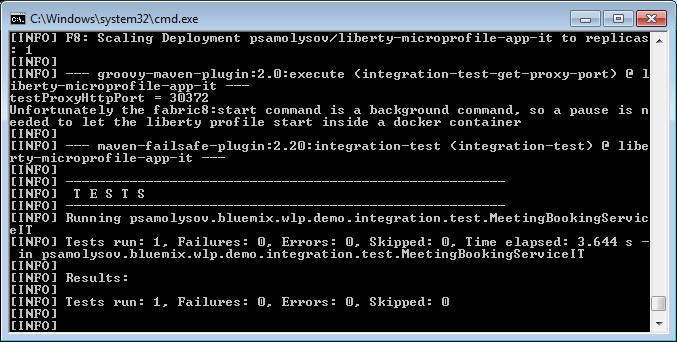

## A WebSphere Liberty Java EE 8 based application prepared for development using Fabric8 Maven Plugin

**WebSphere Liberty** is a fast, dynamic, and easy-to-use Java application server, built on the open source 
[Open Liberty][openliberty] project. Ideal for developers but also ready for production, on-premise or in the cloud.

### The application structure

The demo application is divided into two modules:
 1. *javaee8-webprofile-liberty-app* - a web-application, which leverages Java EE 8 WebProfile and exposes a JAR-RS based RESTful 
 web-service. The application also contains a Java servlet that puts into the output stream the information about on which JVM it 
 works. This information will be important when we try to publish the application on different JVMs within the cloud platform.

 1. *javaee8-webprofile-liberty-app-it* - a set of integration tests for the application. The *[fabric8 maven plugin][f-m-p]* is
 leveraged to deploy the application on a WebSphere Liberty based docker container running inside a Kubernetes cluster and run 
 the integration tests dependent on the containerized application. 


### Deploy the application on a Kubernetes cluster

The demo application uses the *[fabric8 maven plugin][f-m-p]* as an access point to Kubernetes: the application can be deployed on a 
WebSphere Liberty based docker container running inside a Kubernetes cluster and the integration tests run dependent on the containerized
application.

To run the integration tests do the following commands:

1. On Windows, please, download *gofabric8.exe* using 

```
# mvn fabric8:setup
```

2. If you use *[minikube]*, the cluster must be started. To start the cluster use the following command:

```
# minikube start
```
                        
3. All environment variables must be set before using this plugin, see the instruction generated by:

```
# gofabric8 docker-env
```  

4. Build the docker image for the `javaee8-webprofile-liberty-app` application, deploy the image to Kubernetes and run the 
   integration tests:

```
# cd fabric8-maven-plugin/samples/javaee8-webprofile-liberty

# mvn clean verify -DtestProxyHost=192.168.99.100
```

(if you are running the *minikube* virtual machine on *VirtualBox*, `-DtestProxyHost=192.168.99.100` helps you specify the virtual 
machine host. If the integration test fails with error 404, just try to increase the value of the `startPodPause` property in the 
[`javaee8-webprofile-liberty-app-it/pom.xml`](javaee8-webprofile-liberty-app-it/pom.xml) file. The `start` goal is background and 
a pause is needed to let the Liberty profile start inside a docker container.)

P.S. the `fabric8-maven-plugin` isn't able to generate a value of the `nodePort` parameter for exposed services, so a Kubernetes 
implementation generates a new port number for the service after each execution of the `fabric8:apply` goal. 
The [`org.codehaus.gmaven:groovy-maven-plugin`][groovy-maven-plugin] is used to get the dynamic bound `nodePort` value for the 
container with the demo application:

```xml
<plugin>
    <!-- how to get the dynamic bound nodePort for the container in the kubernetes cluster
         idea: https://stackoverflow.com/questions/13887436/maven-exec-bash-script-and-save-output-as-property
         kubectl must be declared in $PATH
    -->
    <groupId>org.codehaus.gmaven</groupId>
    <artifactId>groovy-maven-plugin</artifactId>
    <executions>
        <execution>
            <id>integration-test-get-proxy-port</id>
            <phase>pre-integration-test</phase>
            <goals>
                <goal>execute</goal>
            </goals>
            <configuration>
                <properties>
                    <script>kubectl get service ${applicationArtifactId} -n ${docker.user} -o jsonpath="{.spec.ports[0].nodePort}"</script>
                    <pause>${startPodPause}</pause>
                </properties>
                <source>
                    def pause = properties.pause as Integer             
                    def command = properties.script
                    def process = command.execute()
                    def outputStream = new StringBuffer()
                    process.waitForProcessOutput(outputStream, System.err)
                    def port = outputStream.toString().replace("\"", "").trim()
                    println "testProxyHttpPort = " + port
                    project.properties.testProxyHttpPort = port
                    println "Unfortunately the fabric8:start command is a background command, so a pause is needed to let the liberty profile start inside a docker container"
                    Thread.sleep(pause)
                </source>
            </configuration>
        </execution>
    </executions>
</plugin>
```

(The `kubectl` program must be declared in the environment variable `$PATH`.)



[openliberty]: http://openliberty.io/
[f-m-p]: https://maven.fabric8.io/
[minikube]: https://github.com/kubernetes/minikube
[groovy-maven-plugin]: https://groovy.github.io/gmaven/groovy-maven-plugin/
    